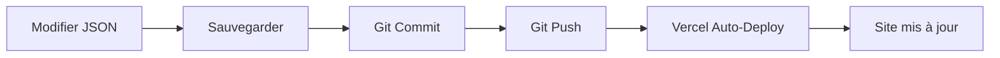

# 🎨 Système de Gestion de Contenu (CMS) - Market-IA

## 📋 Vue d'ensemble

Le site Market-IA utilise un système de gestion de contenu basé sur des **fichiers JSON**. Cette approche simple et efficace vous permet de modifier le contenu sans toucher au code.

---

## 🚀 Accès rapide

### 📁 Fichiers de contenu

Tous les fichiers éditables sont dans le dossier `/content/` :

```
content/
├── site-config.json           # ⚙️ Configuration générale
├── blog/                      # 📰 Articles de blog
│   └── exemple-article.json
└── pages/                     # 📄 Contenu des pages (à venir)
```

---

## 🎯 Comment modifier le contenu ?

### Méthode 1 : Édition directe (Recommandé)

1. **Ouvrez le fichier** dans votre éditeur de code (VS Code, Sublime, etc.)
2. **Modifiez les valeurs** entre guillemets
3. **Sauvegardez** le fichier
4. **Commitez et poussez** sur GitHub
5. **Vercel déploie automatiquement** (1-2 minutes)

### Méthode 2 : Via GitHub (Sans code)

1. Allez sur GitHub : https://github.com/maxence-hue/market-ia-website
2. Naviguez vers le fichier à modifier
3. Cliquez sur l'icône ✏️ (Edit)
4. Modifiez le contenu
5. Cliquez sur "Commit changes"
6. Vercel déploie automatiquement

---

## 📝 Guides détaillés

### 📘 Guide complet
Consultez **[GUIDE-MODIFICATION-CONTENU.md](./GUIDE-MODIFICATION-CONTENU.md)** pour :
- Modifier la page d'accueil
- Ajouter un article de blog
- Gérer les images
- Modifier les paramètres du site
- Exemples pratiques

### 📗 Guide CMS Admin
Consultez **[CMS-ADMIN-GUIDE.md](./CMS-ADMIN-GUIDE.md)** pour :
- Vue d'ensemble du système
- Collections disponibles
- Fonctionnalités avancées
- Support et FAQ

---

## 🎨 Exemples de modifications courantes

### 1️⃣ Changer le titre de la page d'accueil

**Fichier** : `content/site-config.json`

```json
{
  "hero": {
    "title": "Votre Nouveau Titre Ici",
    "subtitle": "Votre nouveau sous-titre"
  }
}
```

### 2️⃣ Ajouter un article de blog

**Créez** : `content/blog/mon-article.json`

```json
{
  "title": "Mon Nouvel Article",
  "slug": "mon-nouvel-article",
  "date": "2025-10-21",
  "author": "Votre Nom",
  "content": [
    {
      "type": "paragraph",
      "text": "Votre contenu ici..."
    }
  ],
  "published": true
}
```

### 3️⃣ Modifier les coordonnées

**Fichier** : `content/site-config.json`

```json
{
  "site": {
    "email": "nouveau@email.com",
    "phone": "+33 6 XX XX XX XX"
  }
}
```

---

## 🖼️ Gestion des images

### Ajouter une image

1. **Placez l'image** dans `/public/images/`
   - Blog : `/public/images/blog/`
   - Services : `/public/images/services/`
   - Équipe : `/public/images/team/`

2. **Référencez-la** dans votre JSON :
   ```json
   {
     "image": "/images/blog/mon-image.jpg"
   }
   ```

### Formats recommandés

- **Format** : JPG, PNG, WebP
- **Taille max** : 2 MB
- **Optimisation** : Utilisez https://tinypng.com/

---

## 🔄 Workflow de déploiement



### Commandes Git

```bash
# 1. Ajouter les modifications
git add content/

# 2. Créer un commit
git commit -m "Mise à jour du contenu"

# 3. Pousser sur GitHub
git push origin main

# 4. Vercel déploie automatiquement (1-2 min)
```

---

## ✅ Checklist avant publication

- [ ] Vérifiez l'orthographe et la grammaire
- [ ] Testez tous les liens
- [ ] Optimisez les images (< 2 MB)
- [ ] Vérifiez le SEO (title, description)
- [ ] Validez le JSON : https://jsonlint.com/
- [ ] Prévisualisez en local : `npm run dev`
- [ ] Commitez avec un message clair

---

## 🆘 Problèmes courants

### ❌ Erreur de syntaxe JSON

**Symptôme** : Le build échoue

**Solution** :
1. Vérifiez les virgules (pas après le dernier élément)
2. Vérifiez les guillemets (toujours doubles `"`)
3. Utilisez https://jsonlint.com/ pour valider

**Exemple d'erreur** :
```json
{
  "title": "Mon titre",
  "subtitle": "Mon sous-titre", ❌ Virgule en trop
}
```

**Correct** :
```json
{
  "title": "Mon titre",
  "subtitle": "Mon sous-titre"
}
```

### ❌ Image ne s'affiche pas

**Solution** :
1. Vérifiez le chemin (commence par `/images/`)
2. Vérifiez que le fichier existe dans `/public/images/`
3. Vérifiez l'extension (jpg, png, webp)

### ❌ Modifications non visibles

**Solution** :
1. Attendez 1-2 minutes pour le déploiement
2. Videz le cache : Ctrl+F5 (Windows) ou Cmd+Shift+R (Mac)
3. Vérifiez sur Vercel : https://vercel.com/marketia/market-ia

---

## 🎓 Ressources

### Documentation
- [Guide de modification du contenu](./GUIDE-MODIFICATION-CONTENU.md)
- [Guide CMS Admin](./CMS-ADMIN-GUIDE.md)

### Outils utiles
- **Validateur JSON** : https://jsonlint.com/
- **Optimisation d'images** : https://tinypng.com/
- **Générateur de slugs** : https://slugify.online/

### Support
- **Email** : maxence@market-ia.com
- **GitHub Issues** : https://github.com/maxence-hue/market-ia-website/issues

---

## 🔐 Bonnes pratiques

1. ✅ **Sauvegardez** avant toute modification importante
2. ✅ **Testez en local** avant de déployer
3. ✅ **Commitez régulièrement** avec des messages clairs
4. ✅ **Optimisez les images** avant upload
5. ✅ **Validez le JSON** avant de commit
6. ✅ **Documentez** vos changements importants

---

## 📊 Structure des données

### Site Config
```json
{
  "site": { ... },      // Infos générales
  "hero": { ... },      // Section hero
  "social": { ... },    // Réseaux sociaux
  "seo": { ... }        // SEO global
}
```

### Article de blog
```json
{
  "title": "...",       // Titre
  "slug": "...",        // URL
  "date": "...",        // Date
  "author": "...",      // Auteur
  "content": [...],     // Contenu
  "tags": [...],        // Tags
  "published": true     // Statut
}
```

---

## 🚀 Prochaines étapes

### Fonctionnalités à venir

- [ ] Interface admin visuelle (Tina CMS)
- [ ] Prévisualisation en temps réel
- [ ] Gestion des médias améliorée
- [ ] Multilingue (FR/EN)
- [ ] Historique des versions
- [ ] Recherche dans le contenu

---

## 📞 Contact

Pour toute question ou assistance :

- **Email** : maxence@market-ia.com
- **Site** : https://market-ia.vercel.app
- **GitHub** : https://github.com/maxence-hue/market-ia-website

---

**Dernière mise à jour** : 21 octobre 2025  
**Version** : 1.0  
**Auteur** : Maxence Alehause
